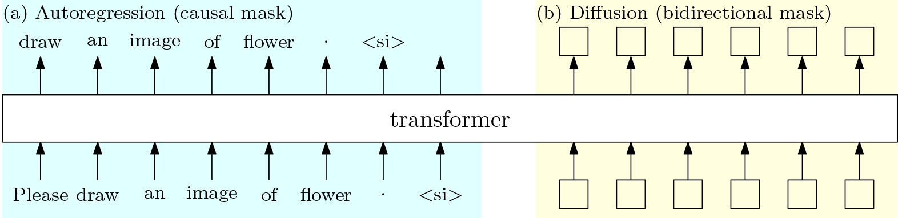
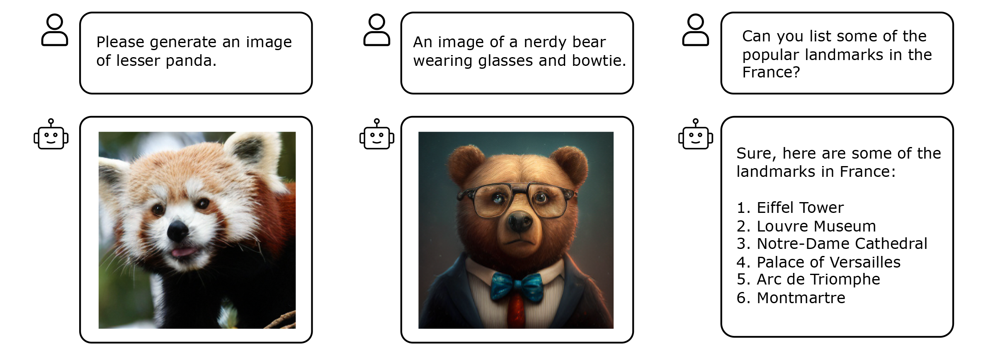

# MonoFormer: One Transformer for Both Diffusion and Autoregression

<div align="center">

[](https://arxiv.org/pdf/2409.16280) [](https://monoformer.github.io/) [](https://github.com/monoformer/MonoFormer) 

</div>




**News**:

- [9/24] We released the training code and inference code.
- [9/24] We released **MonoFormer: One Transformer for Both Diffusion and Autoregression**. Checkout our Arxiv [paper]().

## Content

- [Installation](#installation)
- [Training](#training)
- [Inference](#inference)
- [Sampling](#sampling)
- [Citation](#citation)
- [Acknowledgement](#acknowledgement)


## Todo
- [x] Release the training and inference code for class-conditional generation.
- [ ] Release the training code for text-to-image generation.
- [ ] Release the model weights.
- [ ] Support interleaved multi-modal outputs.


## Installation

1. Clone this repository and navigate to the project folder:

```bash
git clone https://github.com/monoformer/MonoFormer.git
cd MonoFormer
```

2. Install Packages

```bash
conda create -n monoformer python=3.9 -y
conda activate monoformer
pip install -r requirements.txt
```

## Training

1. Prepare dataset

MonoFormer is trained on [ImageNet]((https://image-net.org/download.php)) for class-conditional image generation, [JourneyDB](https://github.com/JourneyDB/JourneyDB) for text-to-image generation, and [UltraChat](https://huggingface.co/datasets/stingning/ultrachat) for text-to-text generation.
Please prepare the appropriate dataset for each respective task.

For detailed guide on how to organize the data and how to prepare your own datasets for training, please refer to [data/README.md](./data/README.md).

Additionally, you can extract VAE features using the script in [tools/extract_vae_features.py](./tools/extract_vae_features.py), which will help accelerate training.

2. Prepare pretrained models

We initialize the LLM using [TinyLLama](https://huggingface.co/TinyLlama/TinyLlama-1.1B-Chat-v1.0) and employ the pretrained [VAE](https://huggingface.co/stabilityai/sd-vae-ft-mse) from Stability AI to extract latent representations. These models are automatically downloaded from HuggingFace. Alternatively, you can manually download them and specify the pretrained path in the [config](./configs).

3. Start training

We have provided training configurations for various datasets and tasks in [./configs](./configs/). You can modify these configurations or create your own for training. All training scripts are located in [./scripts](./scripts/).

For class-conditional generation on the ImageNet dataset:

```bash
torchrun --nproc_per_node 8 train.py \
    --output_dir results/monoformer_imagenet \
    --lr 1e-4 \
    --batch_size_per_gpu 16 \
    --gradient_accumulation_steps 2 \
    --max_grad_norm 2.0 \
    --max_steps 500000 \
    --checkpointing_steps 10000 --log_steps 100 \
    --mixed_precision bf16 --grad_precision fp32 \
    --resolution 256 \
    --config_file configs/train_imagenet.py
```


## Inference



### Run in Jupyter Notebook

ToDo

### CLI Inference

Inference for image generation:

```bash
ckpt='results/monoformer_imagenet_res256_bf16_bs32_lr1e-4/checkpoint-50000'
vae_pretrained_path='stabilityai/sd-vae-ft-mse'
CUDA_VISIBLE_DEVICES=0 torchrun --master_port 39500 --nproc_per_node 1 infer_dit.py --ckpt $ckpt --resolution 256 --vae_pretrained_path $vae_pretrained_path --ema
```

Inferece for text generation:

```bash
ckpt='results/monoformer_ultrachat_journeydb_res256_bf16_bs32_lr1e-4/checkpoint-50000'
CUDA_VISIBLE_DEVICES=0 torchrun --master_port 39500 --nproc_per_node 1 infer_llm.py --ckpt $ckpt
```

## Sampling

Sample class-conditional generation results on ImageNet and saves the sampled images in numpy for evaluation:

```bash
sample_dir='samples/imagenet_cfg_2_step_20_n_10k'
ckpt_dir='results/monoformer_imagenet_res256_bf16_bs32_lr1e-4/checkpoint-50000'
torchrun --nnodes=1 --nproc_per_node=8 sample_ddp.py --ckpt $ckpt_dir \
    --per-proc-batch-size 64 \
    --resolution 256 \
    --ema \
    --num-fid-samples 10000 \
    --imagenet_labels_path ./data/imagenet_labels.json \
    --cfg-scale 2 \
    --num-sampling-steps 20 \
    --sample-dir $sample_dir \
```

## Citation

```bibtex
@article{zhao2024monoformer,
  title={MonoFormer: One Transformer for Both Diffusion and Autoregression},
  author={Zhao, Chuyang and Song, Yuxing and Wang, Wenhao and Feng, Haocheng and Ding, Errui and Sun, Yifan and Xiao, Xinyan and Wang, Jingdong},
  journal={arXiv preprint arXiv:2409.16280},
  year={2024}
}
```

## Acknowledgement

This codebase borrows from [DiT](https://github.com/facebookresearch/DiT), [Large-DiT](https://github.com/Alpha-VLLM/LLaMA2-Accessory/tree/main/Large-DiT-T2I), [LLaVA](https://github.com/haotian-liu/LLaVA), and [TinyLlama](https://github.com/jzhang38/TinyLlama/tree/main). Thanks for their great works.

